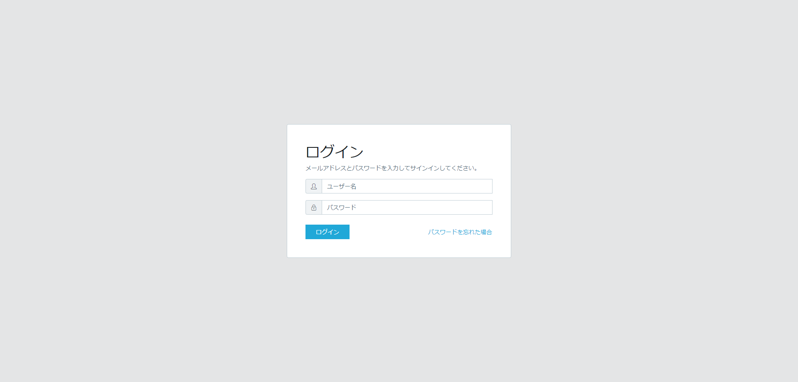
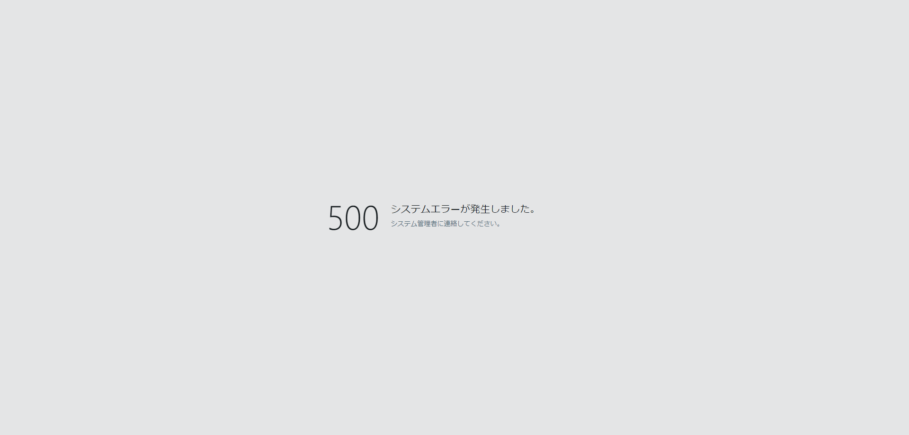
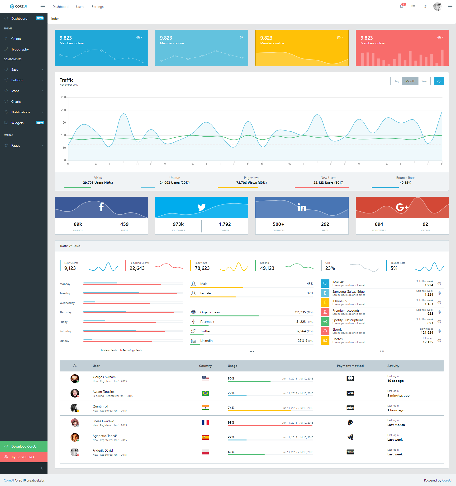

画面共通仕様
============

画面レイアウト
--------------

以下の3つのレイアウトを基本とする

### ログイン画面

ログインの際に使用するレイアウト

### システムエラー画面

システムの使用に関わる問題が発生した場合(DB接続不可、深刻なシステムエラー等)に使用するレイアウト

### 通常画面

上記以外の画面については上部にナビバー、左側にサイドメニューのある通常画面を使用する

通常画面詳細
------------

通常画面は大きく、
* ナビバー
* サイドメニュー
* コンテンツエリア
3つで構成する。各部分の主な役割は以下の通り

### ナビバー

ナビバーは、ロゴの表示、ログインユーザー名の表示、ユーザー関連メニュー(ユーザー情報編集、パスワード変更、ログアウト)を表示する。

### サイドメニュー

サイドメニューは、ユーザー関連メニュー以外の各機能へのアクセスの起点となる。ここからアクセス可能な機能は基本的には一覧もしくはダッシュボード的な画面とし、個別データの編集画面は当該一覧もしくはダッシュボードからアクセスするものとする。なお、メニューの項目は権限ごとに可変とし、アクセス不可能な機能については(表示してリンク無効とするのではなく)非表示とする。

### コンテンツエリア

コンテンツエリアは、各画面毎に具体的に実装するエリアとなる。コンテンツエリアにおいては以下2点を遵守すること

1. 最上部に、画面のタイトルを配すこと
1. タイトル以下に1つ以上のカードを配すこと

また、使用頻度の高い、検索・一覧画面及び詳細画面については別途テンプレートをするのでそれを利用してUIの統一化を図る